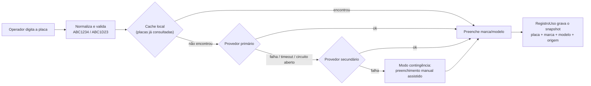

# Plano de migração: registro aberto por placa com consulta externa

## 1. Situação atual (o que existe hoje)

| Ponto | Implementação atual |
|:---|:---|
| Cadastro de veículo | [Viatura](file:///f:/_PROJETOS_PYHTON/app_viaturas/veiculos/models.py#L26-L176), cadastrada antes, com placa única, marca, modelo, setor, km e status |
| Lançamento na ficha | [RegistroUso.viatura](file:///f:/_PROJETOS_PYHTON/app_viaturas/fichas/models.py#L211-L216) é uma `ForeignKey` obrigatória (`PROTECT`) |
| Seleção na tela | `ModelChoiceField`/`Select` em [fichas/forms.py](file:///f:/_PROJETOS_PYHTON/app_viaturas/fichas/forms.py#L398-L420), filtrado por `ativo` e `status` |
| Estado "em trânsito" | Gravado em `Viatura.status` pelo [RegistroUso.save()](file:///f:/_PROJETOS_PYHTON/app_viaturas/fichas/models.py#L390-L442) |
| Validação de odômetro | Usa `Viatura.km_atual` como mínimo |
| Dependentes | dashboard, relatórios PDF/Excel, auditoria, permissões, seed e testes |

> [!IMPORTANT]
> **Premissa:** "sem base de dados" quer dizer **sem cadastro prévio de veículos**. As fichas, os registros, os vistos, os usuários e a auditoria **continuam sendo gravados**, porque são a fé pública do sistema. O que deixa de existir é a obrigação de cadastrar a viatura antes de lançar a movimentação.

---

## 2. Arquitetura proposta



### 2.1 Camada de serviço `services/consulta_placa/`
- `base.py`: interface `ProvedorPlaca.consultar(placa) -> DadosVeiculo | None`.
- `provedores/`: um adaptador por API (`serpro.py`, `apiplacas.py`, `apibrasil.py`).
- `orquestrador.py`: percorre a cadeia **cache → primário → secundário → manual**.
  - Timeout curto (3 s) por provedor.
  - **Circuit breaker**: depois de N falhas seguidas, pula o provedor por X minutos.
  - Normaliza o retorno: `marca`, `modelo`, `cor`, `ano`, `provedor`, `consultado_em`.
- A configuração fica no `.env`: `PLACA_PROVEDORES=serpro,apiplacas`, tokens e `HTTPS_PROXY`. A rede institucional normalmente exige proxy.
- Retorna **apenas dados do veículo**. Dados do proprietário são descartados (LGPD).

### 2.2 Endpoint interno
- `GET /fichas/api/placa/<placa>/` → JSON com `{marca, modelo, cor, origem, provedor}`.
- Exige login, tem rate limit por usuário e cada consulta gera registro na auditoria existente ([audit_service.py](file:///f:/_PROJETOS_PYHTON/app_viaturas/accesscontrol/audit_service.py)).

### 2.3 Interface (Frontline PF)
- O `Select` de viatura dá lugar a um campo **Placa** com máscara Mercosul/antiga.
- A consulta dispara no `blur` ou com 7 caracteres válidos. Durante a consulta aparece um spinner.
- Os campos Marca e Modelo são preenchidos e **continuam editáveis**. Um badge mostra a origem:
  - Verde: "Consultado (provedor X)"
  - Azul: "Histórico local"
  - Dourado: "Preenchimento manual: contingência"

---

## 3. Contingência (API inacessível ou desativada)

| Nível | Mecanismo | Efeito |
|:---|:---|:---|
| 1 | **Cache local que se alimenta sozinho**: tabela `PlacaConsultada` gravada a cada consulta ou lançamento bem-sucedido | Placas recorrentes, como a frota própria, não dependem da API |
| 2 | **Múltiplos provedores** em cadeia com circuit breaker | Um provedor fora do ar não para o sistema |
| 3 | **Manual assistido**: Marca vira autocomplete com catálogo FIPE **offline** (JSON versionado no repositório) e Modelo é filtrado pela marca | O operador nunca fica bloqueado |
| 4 | **Reconciliação posterior**: registros com `origem=MANUAL` entram em fila (management command agendado) e são reconsultados quando a API volta. Divergências vão para revisão | Qualidade dos dados sem travar a portaria |
| 5 | **Indicador de saúde** no dashboard: status de cada provedor e última falha | Visibilidade para o administrador |

> [!TIP]
> O nível 1 já resolve a maior parte dos casos: numa unidade, a maioria das placas lançadas se repete todo dia.

---

## 4. Alterações no modelo de dados

**`RegistroUso`** recebe um *snapshot* do veículo. É isso que garante a fidelidade do registro histórico mesmo que a API mude depois.

```diff
- viatura = models.ForeignKey(Viatura, on_delete=models.PROTECT, ...)
+ viatura = models.ForeignKey(Viatura, on_delete=models.PROTECT, null=True, blank=True, ...)
+ placa = models.CharField(max_length=7, db_index=True)        # normalizada, sem hífen
+ marca = models.CharField(max_length=50)
+ modelo = models.CharField(max_length=80)
+ cor = models.CharField(max_length=30, blank=True)
+ origem_dados = models.CharField(choices=[FROTA, CACHE, API, MANUAL])
+ provedor_consulta = models.CharField(max_length=30, blank=True)
+ pendente_reconciliacao = models.BooleanField(default=False)
```

**Nova tabela `PlacaConsultada`** (cache e histórico): `placa` (único), `marca`, `modelo`, `cor`, `ano`, `provedor`, `consultado_em`, `validado_api`.

**Regras de negócio derivadas por placa** (deixam de depender de `Viatura.status` e `km_atual`):
- *Em trânsito* = existe `RegistroUso(placa=X, status=EM_TRANSITO)`.
- *Odômetro mínimo* = maior `odometro_chegada` registrado para a placa.
- Se a placa existir em `Viatura`, o vínculo continua sendo feito (`origem=FROTA`) e o módulo de manutenção segue funcionando.

**Migração de dados**: uma data migration copia `viatura.placa/marca/modelo/cor` para todos os `RegistroUso` existentes e popula `PlacaConsultada` a partir das viaturas cadastradas.

---

## 5. Fases de execução

| Fase | Entregas | Arquivos principais |
|:---|:---|:---|
| **0. Decisões** | Escolha do provedor e do contrato, definição do escopo da frota ou manutenção (ver §7) | — |
| **1. Serviço** | `services/consulta_placa/` com provedores, orquestrador, circuit breaker, cache e testes com *mocks* HTTP | `services/`, `core/settings.py`, `.env.example`, `requirements.txt` (`httpx`) |
| **2. Modelo** | Campos de snapshot, `PlacaConsultada`, data migration, regras derivadas por placa | [fichas/models.py](file:///f:/_PROJETOS_PYHTON/app_viaturas/fichas/models.py) |
| **3. Formulários e telas** | Campo placa, endpoint JSON, JS de consulta, badges de origem, autocomplete FIPE | [fichas/forms.py](file:///f:/_PROJETOS_PYHTON/app_viaturas/fichas/forms.py), [fichas/views.py](file:///f:/_PROJETOS_PYHTON/app_viaturas/fichas/views.py), `templates/fichas/`, `static/js/` |
| **4. Consumidores** | Dashboard (KPIs "em trânsito" por placa), PDF/Excel usando o snapshot, auditoria | [dashboard/views.py](file:///f:/_PROJETOS_PYHTON/app_viaturas/dashboard/views.py), [relatorios_pdf.py](file:///f:/_PROJETOS_PYHTON/app_viaturas/services/relatorios_pdf.py), [relatorios_excel.py](file:///f:/_PROJETOS_PYHTON/app_viaturas/services/relatorios_excel.py) |
| **5. Contingência** | Command `reconciliar_placas`, painel de saúde dos provedores | `fichas/management/commands/` |
| **6. Implantação** | Feature flag `REGISTRO_ABERTO_ATIVO` para convivência com o modo atual, depois desligamento do `Select` | settings, templates |
| **7. Documentação** | `evolucao.md`, README, `docs/` | — |

---

## 6. APIs de consulta por placa: análise

> [!WARNING]
> **Não existe hoje uma API ao mesmo tempo gratuita, confiável e legítima** para consulta de placa no Brasil. As que são gratuitas dependem de engenharia reversa e quebram com frequência. As confiáveis são pagas ou exigem convênio oficial.

| Opção | Custo | Confiabilidade | Observações | Recomendação |
|:---|:---|:---|:---|:---|
| **`sinesp-api` (npm)** e similares | Gratuito | ❌ Baixa | Engenharia reversa do app Sinesp Cidadão. Quebra com captcha/token, bloqueia IP fora do Brasil, não tem manutenção e o uso automatizado viola os termos | **Não usar** |
| **Serpro: API Consulta SENATRAN/RENAVAM** (ou acesso institucional via SINESP/Córtex) | Contrato ou convênio governamental | ✅ Alta (fonte oficial) | Para um sistema da PF é o caminho **legítimo e mais estável**. Verificar com a DTI se já há convênio ativo | **Primário recomendado** |
| **API Placas** (apiplacas.com.br / WDAPI) | Pago por consulta, com créditos de teste | ✅ Boa | REST + token. Retorna marca, modelo, ano, cor e UF | Secundário |
| **APIBrasil** (apibrasil.io) | Créditos / planos | ✅ Boa | REST + token, tem SDKs. Também consulta FIPE | Secundário alternativo |
| **SimplesAPI / ConsultarPlaca** | Créditos | ⚠️ Média | Modelo de créditos. Avaliar SLA | Alternativa |
| **API FIPE pública** (parallelum.com.br/fipe) | Gratuito | ✅ Boa | **Não consulta placa**: só fornece o catálogo marca → modelo → ano | **Base do fallback manual** (snapshot offline) |

Os valores dos provedores comerciais mudam com frequência. É preciso confirmar o preço atual e o SLA antes de contratar. Com o cache local, o número de consultas pagas por dia tende a ser baixo.

---

## 7. Decisões pendentes

1. **Frota e manutenção**: o módulo `veiculos` (manutenções, alertas de revisão, km) continua existindo para a frota própria (registro híbrido) ou é desativado?
2. **Provedor primário**: existe convênio Serpro/SENATRAN disponível para a unidade, ou começamos com provedor comercial?
3. **Saída do servidor para a internet**: o servidor de produção acessa APIs externas diretamente ou via proxy institucional?
4. **Divergência na reconciliação**: quando a API retornar uma marca/modelo diferente do lançado manualmente, o sistema só sinaliza ou corrige automaticamente? Lembrando que fichas encerradas não podem ser alteradas.
